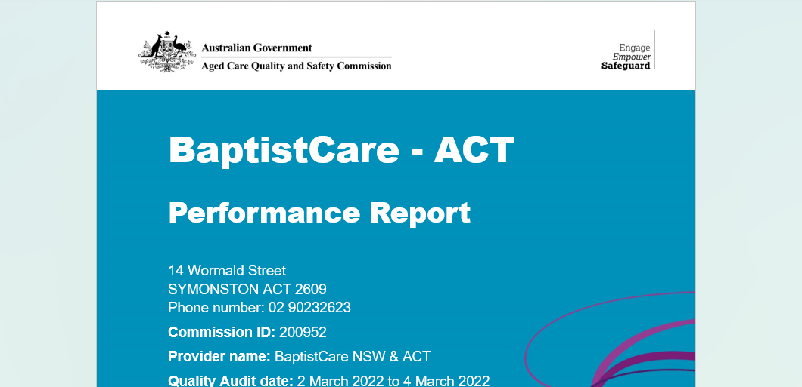

# 🧠 Aged Care Automation Suite
> ⚡ Built to power the **data pipeline for training a Healthcare AI**  
A Python-based automated solution to streamline the collection of public aged care data from government and provider websites.  
It helps reduce manual effort by programmatically gathering, extracting, and logging useful provider information.

---

## 🔍 What It Does

This suite automates the following processes:

- ✅ **Compliance Report Retrieval**  
  Seamlessly locates and downloads official `.docx` compliance reports from government service directories using provider-specific search parameters.

- ✅ **Smart Pricing Discovery**  
  Combines intelligent Google search with browser automation to identify and download **pricing PDFs** directly from provider websites.  
  If no PDF is found, the tool captures a **visual snapshot** of relevant pricing content for reference.

- ✅ **Star Rating Collection**  
  Programmatically extracts publicly available **star ratings** and quality metrics from agedcarequality.gov.au, ready for integration into dashboards or analytics workflows.

- ✅ **Automated Logging to Google Sheets**  
  All provider details, report links, and outcomes are recorded into a structured Google Sheet — no manual copy-pasting required.

---

## ⚙️ Technology

- Python + Playwright for browser automation  
- Google Sheets API for real-time logging  
- SerpAPI for intelligent Google fallback  
- Requests, Pandas, and BeautifulSoup for parsing and data handling

---
| 📄 Compliance Report (.docx) | 📑 Pricing PDF (auto-located) |
|-----------------------------|-------------------------------|
|  |  |

## 🔐 Setup

### 1. Install dependencies

```bash
pip install -r requirements.txt
